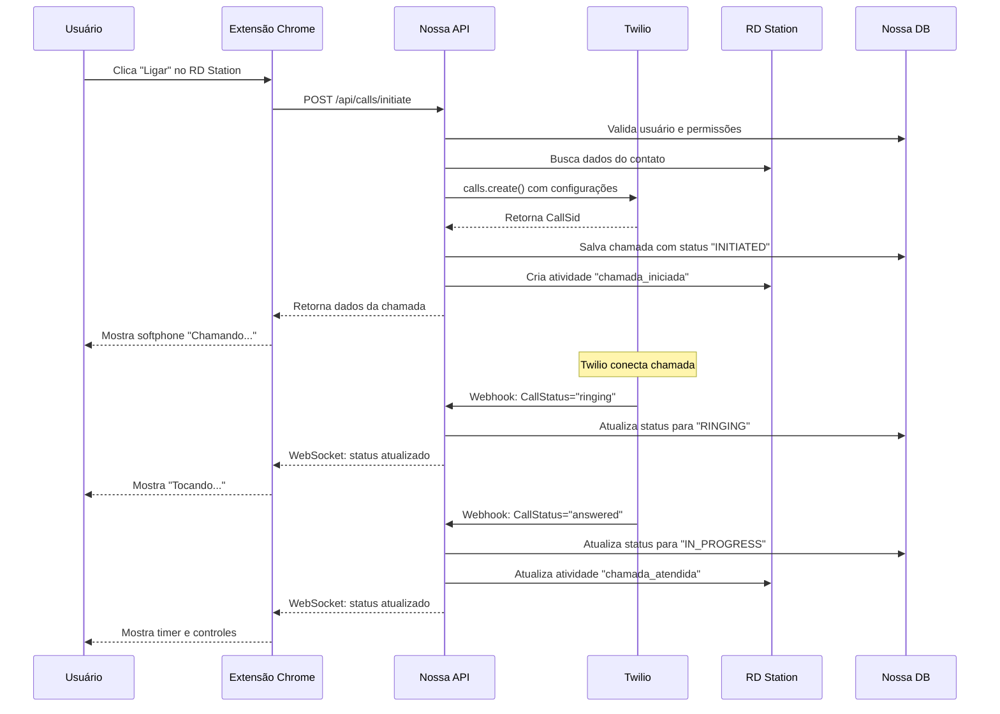
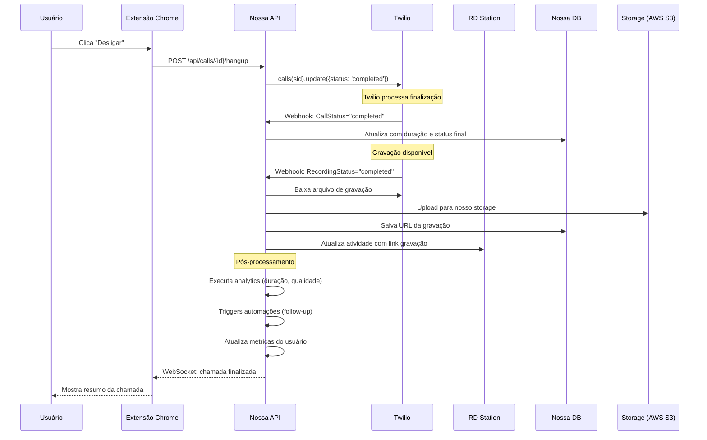
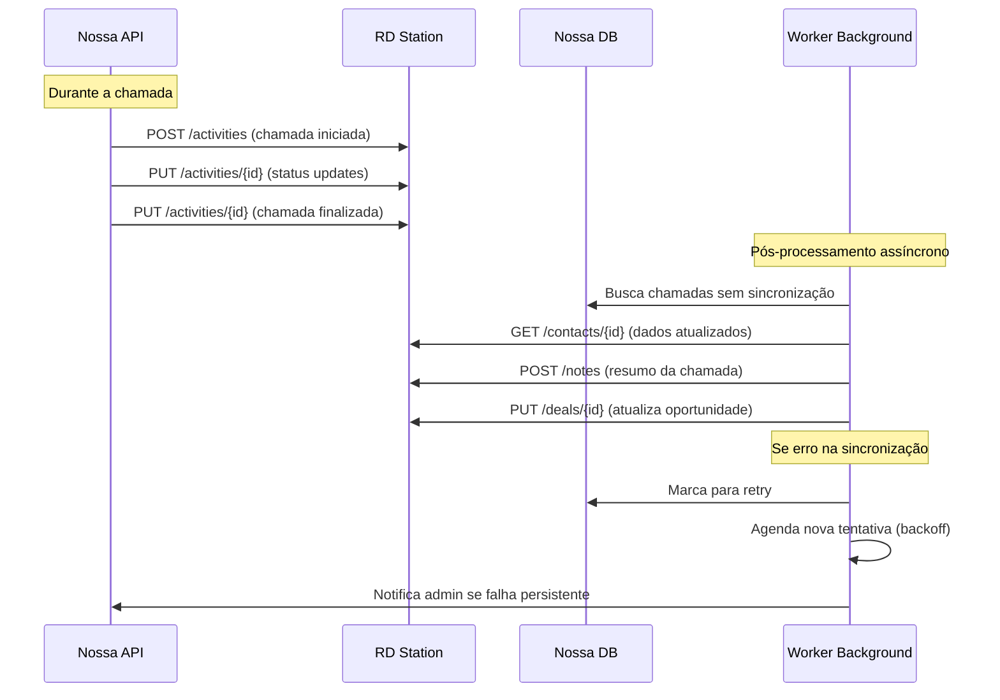

# **Documentação Técnica: Integração Twilio - Click-to-Call Platform**

## **📋 Sumário**

- [Visão Geral da Arquitetura](#visão-geral-da-arquitetura)
- [Por Que Twilio?](#por-que-twilio)
- [Modelo de Integração](#modelo-de-integração)
- [Estrutura de Custos](#estrutura-de-custos)
- [Implementação Técnica](#implementação-técnica)
- [Fluxos de Dados](#fluxos-de-dados)
- [Vantagens Competitivas](#vantagens-competitivas)
- [Comparação com Alternativas](#comparação-com-alternativas)
- [Roadmap de Implementação](#roadmap-de-implementação)

---

## **🏗️ Visão Geral da Arquitetura**

### **Conceito Fundamental**

O Twilio atua como **infraestrutura de telecomunicações invisível**, enquanto mantemos **controle total** sobre:
- Interface do usuário (100% nossa)
- Experiência do cliente (100% nossa)
- Dados e lógica de negócio (100% nossos)
- Marca e identidade (100% nossa)

```
┌─────────────────────────────────────────────────────────────┐
│                    NOSSA PLATAFORMA                         │
├─────────────────────────────────────────────────────────────┤
│  🎨 FRONTEND (100% NOSSO)                                   │
│  ├── React + TypeScript                                    │
│  ├── Design System próprio                                 │
│  ├── UX otimizada para RD Station                          │
│  └── Chrome Extension personalizada                        │
├─────────────────────────────────────────────────────────────┤
│  ⚙️ BACKEND (100% NOSSO)                                    │
│  ├── Node.js + Express APIs                                │
│  ├── Lógica de negócio própria                             │
│  ├── Integração RD Station                                 │
│  ├── Banco de dados PostgreSQL                             │
│  └── Sistema de autenticação JWT                           │
├─────────────────────────────────────────────────────────────┤
│  📞 TWILIO (INFRAESTRUTURA INVISÍVEL)                      │
│  ├── Servidores de voz globais                             │
│  ├── Conectividade com operadoras                          │
│  ├── WebRTC SDK                                            │
│  ├── Gravação e armazenamento                              │
│  └── Roteamento inteligente                                │
└─────────────────────────────────────────────────────────────┘
```

### **Separação de Responsabilidades**

| **Componente** | **Nossa Responsabilidade** | **Responsabilidade Twilio** |
|----------------|----------------------------|------------------------------|
| **Interface** | ✅ Design, UX, funcionalidades | ❌ Não se envolve |
| **Autenticação** | ✅ JWT, OAuth2, permissões | ❌ Não se envolve |
| **Dados** | ✅ Banco próprio, relatórios | ❌ Só dados técnicos de voz |
| **Integração RD** | ✅ APIs, webhooks, sync | ❌ Não se envolve |
| **Voz/Chamadas** | ❌ Só iniciamos via API | ✅ Infraestrutura completa |
| **Qualidade Audio** | ❌ Só configuramos | ✅ Codecs, otimização |
| **Compliance** | ✅ LGPD, dados clientes | ✅ Telecomunicações |

---

## **🎯 Por Que Twilio?**

### **1. Timing Estratégico**

**Contexto:** Zenvia descontinuou parceria com RD Station, criando mercado órfão.

```
🏃‍♂️ VELOCIDADE É CRÍTICA:
├── Twilio SDK maduro → Desenvolvimento em semanas
├── APIs bem documentadas → Menor curva aprendizado  
├── WebRTC nativo → Sem instalações no cliente
└── Comunidade ativa → Suporte durante desenvolvimento
```

### **2. Vantagens Técnicas Decisivas**

#### **WebRTC Nativo vs Concorrentes**
```typescript
// ✅ Com Twilio - Chamadas direto no navegador
const call = await device.connect({
  params: { To: '+5511999999999' }
});
// Sem downloads, plugins ou configurações

// ❌ Concorrentes tradicionais exigem:
// - Download de softphones
// - Instalação de plugins SIP
// - Configurações complexas de rede
```

#### **APIs Modernas e Completas**
```typescript
// ✅ Uma linha para chamada com recursos avançados
const call = await twilio.calls.create({
  to: '+5511999999999',
  from: '+5511888888888',
  record: true,                    // Gravação automática
  statusCallback: '/webhooks',     // Eventos em tempo real
  timeout: 30,                     // Controle fino
  machineDetection: 'Enable'       // Detecta secretária eletrônica
});
```

### **3. Vantagens de Negócio**

#### **Custo Competitivo e Transparente**
```
💰 Modelo Pay-per-Use Real:
├── R$ 0,06-0,15/min (vs Zenvia R$ 0,25-0,40/min)
├── Sem mensalidades fixas altas
├── Tarifas transparentes
└── Descontos por volume automáticos
```

#### **Escalabilidade Automática**
```
📈 Crescimento sem Infraestrutura:
├── 1 usuário → R$ 50/mês
├── 100 usuários → R$ 5.000/mês  
├── 1000 usuários → R$ 50.000/mês
└── Twilio escala automaticamente
```

---

## **🔧 Modelo de Integração**

### **Frontend: 100% Nossa Interface**

#### **Chrome Extension para RD Station**
```javascript
// Nossa extensão injeta botões no RD Station
(function() {
  // Busca números na página do RD
  const phoneElements = document.querySelectorAll('[data-phone]');
  
  phoneElements.forEach(phone => {
    const callButton = createClickToCallButton({
      number: phone.textContent,
      contactId: extractContactId(phone),
      // Nossa marca e design
      branding: 'nossa-empresa',
      style: 'nosso-design-system'
    });
    
    phone.parentNode.appendChild(callButton);
  });
})();
```

#### **Componente Softphone React**
```tsx
// Nossa interface, Twilio invisível nos bastidores
export const NossoSoftphone: React.FC<SoftphoneProps> = ({
  contactNumber,
  contactName,
  onCallComplete
}) => {
  const [device, setDevice] = useState<Device | null>(null);
  const [callStatus, setCallStatus] = useState<CallStatus>('idle');
  
  return (
    <div className="nossa-marca-bg rounded-nossa-esquina">
      {/* Header com nossa identidade */}
      <header className="flex items-center nossa-cor-primaria">
        <NossaLogo />
        <h1>Nossa Empresa - Click to Call</h1>
      </header>
      
      {/* Área de chamada com nosso design */}
      <div className="chamada-container">
        <div className="contato-info">
          <h3 className="nossa-tipografia">{contactName}</h3>
          <p className="text-nossa-cor-secundaria">{contactNumber}</p>
        </div>
        
        {/* Controles com nossa UX */}
        <div className="controles-chamada">
          {callStatus === 'idle' && (
            <BotaoLigar 
              onClick={() => iniciarChamadaTwilio(contactNumber)}
              className="nosso-botao-primario"
            />
          )}
          
          {callStatus === 'connected' && (
            <>
              <Timer className="nossa-fonte-mono" />
              <BotaoDesligar 
                onClick={() => encerrarChamadaTwilio()}
                className="nosso-botao-perigo"
              />
            </>
          )}
        </div>
      </div>
      
      {/* Footer com nossos recursos exclusivos */}
      <footer className="recursos-exclusivos">
        <ToggleGravacao />
        <IndicadorQualidade />
        <BotaoAnotacoes />
      </footer>
    </div>
  );
};
```

### **Backend: Nossa Lógica + Twilio como Fornecedor**

#### **Serviço de Chamadas**
```typescript
// Nossa orquestração, Twilio como executor
export class NossoServicoVoz {
  private twilioClient: Twilio;
  private rdStationService: RDStationService;
  private database: DatabaseService;
  
  async iniciarChamada(dadosNossos: ChamadaRequest) {
    // 1. NOSSA VALIDAÇÃO E LÓGICA
    const usuario = await this.validarUsuario(dadosNossos.userId);
    const empresa = await this.buscarConfiguracao(usuario.empresaId);
    const contato = await this.rdStationService.buscarContato(dadosNossos.contactId);
    
    // 2. NOSSA PREPARAÇÃO
    const configuracaoChamada = this.prepararConfiguracaoChamada({
      from: empresa.numeroTwilio,
      to: contato.telefone,
      userId: usuario.id,
      contactId: contato.id
    });
    
    // 3. TWILIO EXECUTA (mas controlamos tudo)
    const chamadaTwilio = await this.twilioClient.calls.create({
      to: configuracaoChamada.to,
      from: configuracaoChamada.from,
      url: this.gerarTwiMLUrl(configuracaoChamada),
      record: empresa.gravarChamadas,
      recordingStatusCallback: `${this.baseUrl}/webhooks/gravacao`,
      statusCallback: `${this.baseUrl}/webhooks/status-chamada`,
      statusCallbackEvent: ['initiated', 'ringing', 'answered', 'completed'],
      // Configurações nossas específicas
      timeout: empresa.timeoutChamada || 30,
      machineDetection: empresa.detectarSecretaria ? 'Enable' : 'Disable'
    });
    
    // 4. NOSSA PERSISTÊNCIA E CONTROLE
    const chamadaNossa = await this.database.calls.create({
      id: generateUniqueId(),
      twilioCallSid: chamadaTwilio.sid,
      userId: usuario.id,
      empresaId: empresa.id,
      contatoRdId: contato.id,
      numeroOrigem: configuracaoChamada.from,
      numeroDestino: configuracaoChamada.to,
      status: 'INICIADA',
      iniciadaEm: new Date(),
      // Nossos campos customizados
      campanhaId: dadosNossos.campanhaId,
      prioridade: dadosNossos.prioridade,
      observacoes: dadosNossos.observacoes
    });
    
    // 5. NOSSA INTEGRAÇÃO RD STATION
    await this.rdStationService.criarAtividade({
      contactId: contato.id,
      tipo: 'chamada_iniciada',
      dados: {
        numeroDestino: configuracaoChamada.to,
        operador: usuario.nome,
        timestampInicio: new Date().toISOString()
      }
    });
    
    return chamadaNossa;
  }
  
  // NOSSO WEBHOOK para eventos Twilio
  async processarEventoTwilio(webhook: TwilioWebhook) {
    const chamada = await this.database.calls.findByTwilioSid(webhook.CallSid);
    
    switch (webhook.CallStatus) {
      case 'ringing':
        await this.atualizarStatus(chamada.id, 'TOCANDO');
        break;
        
      case 'in-progress':
        await this.atualizarStatus(chamada.id, 'EM_ANDAMENTO');
        await this.rdStationService.atualizarAtividade(chamada.contatoRdId, {
          status: 'atendida',
          timestampAtendimento: new Date().toISOString()
        });
        break;
        
      case 'completed':
        await this.finalizarChamada(chamada.id, {
          duracaoSegundos: parseInt(webhook.CallDuration),
          urlGravacao: webhook.RecordingUrl,
          motivoEncerramento: webhook.CallStatus
        });
        break;
    }
    
    // Nossa lógica de pós-processamento
    await this.executarAcoesPosChamada(chamada);
  }
}
```

---

## **💰 Estrutura de Custos Detalhada**

### **Custos Diretos Twilio (Brasil - 2024)**

#### **Chamadas de Voz**
```
📞 OUTBOUND (Fazemos chamadas):
├── Fixo Nacional: R$ 0,06/minuto
├── Móvel Nacional: R$ 0,15/minuto  
├── Celular SP/RJ: R$ 0,12/minuto
└── Internacional: R$ 0,30-1,20/minuto

📞 INBOUND (Recebemos - se implementarmos):
├── Fixo Nacional: R$ 0,03/minuto
├── Móvel Nacional: R$ 0,08/minuto
└── Toll-free (0800): R$ 0,05/minuto
```

#### **Números de Telefone**
```
📱 NÚMEROS TWILIO:
├── Local brasileiro: R$ 5,00/mês
├── Toll-free (0800): R$ 10,00/mês
├── Internacional: R$ 15-25/mês
└── Números premium: R$ 50-100/mês
```

#### **Recursos Adicionais**
```
🎥 GRAVAÇÕES:
├── Armazenamento: R$ 0,25/GB/mês
├── Transcrição IA: R$ 0,50/minuto
└── Análise de sentimento: R$ 0,75/minuto

💬 OUTROS (Expansão futura):
├── SMS nacional: R$ 0,15/unidade
├── WhatsApp Business: R$ 0,30/mensagem
└── Video calls: R$ 0,40/minuto
```

### **Nossa Estratégia de Precificação**

#### **Modelo 1: Markup sobre Consumo**
```
📊 MARGEM DE LUCRO POR TIPO:

┌────────────────┬──────────────┬─────────────┬─────────────┐
│ Tipo Chamada   │ Custo Twilio │ Preço Nosso │   Margem    │
├────────────────┼──────────────┼─────────────┼─────────────┤
│ Fixo Nacional  │ R$ 0,06/min  │ R$ 0,15/min │    150%     │
│ Móvel Nacional │ R$ 0,15/min  │ R$ 0,30/min │    100%     │
│ Internacional  │ R$ 0,50/min  │ R$ 1,00/min │    100%     │
│ Gravação       │ R$ 0,25/GB   │ R$ 0,50/GB  │    100%     │
│ Número Mensal  │ R$ 5,00/mês  │ R$ 15,00/mês│    200%     │
└────────────────┴──────────────┴─────────────┴─────────────┘

💡 MARGEM BRUTA MÉDIA: 100-150%
```

#### **Modelo 2: Planos SaaS com Pacotes**
```
📦 PLANO ESSENCIAL - R$ 149/mês
├── 300 minutos inclusos (custo: R$ 30)
├── 1 número Twilio (custo: R$ 5)
├── Gravações básicas (1GB)
├── Integração RD Station
└── Excedente: R$ 0,30/min

📦 PLANO PROFISSIONAL - R$ 399/mês  
├── 1.500 minutos inclusos (custo: R$ 150)
├── 3 números Twilio (custo: R$ 15)
├── Gravações ilimitadas
├── Analytics avançado
├── API própria
└── Excedente: R$ 0,25/min

📦 PLANO ENTERPRISE - R$ 999/mês
├── 5.000 minutos inclusos (custo: R$ 500)
├── 10 números Twilio (custo: R$ 50)
├── IA para análise de chamadas
├── White-label
├── Suporte dedicado
└── Excedente: R$ 0,20/min
```

### **Simulação Financeira Real**

#### **Cliente Típico (1.000 min/mês)**
```
💸 NOSSOS CUSTOS MENSAIS:
├── Twilio chamadas: R$ 100 (1000 min × R$ 0,10 médio)
├── Números (2x): R$ 10
├── Gravações (2GB): R$ 0,50
├── Nossa infraestrutura: R$ 15
└── TOTAL CUSTO: R$ 125,50

💰 NOSSA RECEITA:
├── Plano Profissional: R$ 399
├── MARGEM BRUTA: R$ 273,50 (69%)
├── Custos operacionais: R$ 80
└── MARGEM LÍQUIDA: R$ 193,50 (48%)
```

### **Economia de Escala com Twilio**

#### **Descontos por Volume**
```
📈 NEGOCIAÇÃO TWILIO:
├── 0-50k min/mês: Preço padrão
├── 50k-500k min/mês: -10% desconto  
├── 500k-2M min/mês: -20% desconto
├── 2M+ min/mês: -30% desconto
└── Enterprise: Pricing customizado

💡 Com 500 clientes, já temos desconto de 20%!
```

---

## **🔄 Fluxos de Dados Detalhados**

### **Fluxo 1: Iniciação de Chamada**



### **Fluxo 2: Finalização e Pós-Processamento**



### **Fluxo 3: Sincronização com RD Station**



---

## **🚀 Vantagens Competitivas**

### **1. Experiência Superior ao Usuário**

#### **WebRTC vs Telefonia Tradicional**
```
✅ NOSSA SOLUÇÃO (Twilio WebRTC):
├── Clique → 2 segundos → Conectado
├── Qualidade HD (codecs opus/pcmu)
├── Sem downloads ou instalações
├── Funciona em qualquer navegador
├── Controle de volume/microfone
└── Integração nativa com CRM

❌ CONCORRENTES TRADICIONAIS:
├── Download softphone → 5-10 minutos setup
├── Qualidade variável (depende rede)
├── Configurações SIP complexas
├── Problemas com firewall/NAT
├── Interface separada do CRM
└── Suporte técnico constante
```

#### **UX Otimizada para RD Station**
```typescript
// Nossa extensão se adapta ao RD Station
const detectRDPageType = () => {
  if (window.location.includes('/contacts/')) {
    return 'contact-detail';
  }
  if (window.location.includes('/deals/')) {
    return 'deal-detail';
  }
  if (window.location.includes('/activities/')) {
    return 'activities-list';
  }
};

// Botão aparece no contexto certo
const addCallButton = (pageType) => {
  switch (pageType) {
    case 'contact-detail':
      // Botão principal no header do contato
      addButtonToContactHeader();
      break;
    case 'deal-detail':
      // Botão na seção de ações da oportunidade
      addButtonToDealActions();
      break;
    case 'activities-list':
      // Botão inline para cada atividade pendente
      addButtonToActivityItems();
      break;
  }
};
```

### **2. Dados e Analytics Próprios**

#### **Dashboard Exclusivo**
```typescript
// Métricas que só nós temos
interface NossasMetricas {
  // Métricas operacionais
  totalChamadas: number;
  taxaConexao: number;
  duracaoMedia: number;
  custoMedio: number;
  
  // Métricas de vendas (integração RD)
  chamadasPorFunil: FunnelMetrics[];
  conversaoPorVendedor: VendedorMetrics[];
  impactoNasVendas: RevenueImpact;
  
  // Métricas de qualidade
  qualidadeAudio: AudioQualityMetrics;
  satisfacaoCliente: SatisfactionScore;
  problemasTecnicos: TechnicalIssues[];
  
  // Insights com IA (futuro)
  melhorHorarioLigar: TimeOptimization;
  previsaoConversao: ConversionPrediction;
  sugestoesMelhoria: ImprovementSuggestions[];
}
```

### **3. Flexibilidade e Evolução Rápida**

#### **Funcionalidades Exclusivas**
```typescript
// Recursos que podemos desenvolver rapidamente
class RecursosExclusivos {
  
  // Discagem inteligente baseada em dados RD
  async discagemInteligente(contatoId: string) {
    const contato = await this.rdStation.getContact(contatoId);
    const historico = await this.database.getCallHistory(contatoId);
    
    // IA decide melhor horário e abordagem
    const estrategia = await this.ia.analisarMelhorAbordagem({
      funil: contato.funnelStage,
      interacoesAnteriores: historico,
      perfilComportamental: contato.behavior
    });
    
    return estrategia;
  }
  
  // Auto-follow up baseado em resultado da chamada
  async autoFollowUp(chamadaId: string) {
    const chamada = await this.database.getChamada(chamadaId);
    const transcricao = await this.twilio.getTranscription(chamada.recordingUrl);
    
    // IA analisa o que aconteceu na chamada
    const resultado = await this.ia.analisarChamada(transcricao);
    
    if (resultado.agendarNovaChamada) {
      await this.rdStation.createTask({
        contactId: chamada.contatoId,
        tipo: 'call',
        prazo: resultado.prazoSugerido,
        observacoes: resultado.pontosImportantes
      });
    }
  }
  
  // Coaching em tempo real para vendedores
  async coachingTempoReal(chamadaId: string) {
    const transcricaoLive = await this.twilio.getLiveTranscription(chamadaId);
    const sugestoes = await this.ia.analisarConversa(transcricaoLive);
    
    // Envia dicas para o vendedor via WebSocket
    this.websocket.send({
      tipo: 'coaching_tip',
      chamadaId,
      sugestao: sugestoes.proximaAcao,
      urgencia: sugestoes.nivel
    });
  }
}
```

---

## **🔍 Comparação com Alternativas**

### **Twilio vs Concorrentes Diretos**

| **Aspecto** | **Nossa Solução<br/>(Twilio)** | **Zenvia<br/>(Descontinuado)** | **TotalVoice** | **Asterisk<br/>Self-hosted** |
|-------------|--------------------------------|--------------------------------|----------------|------------------------------|
| **Time to Market** | ⚡ 6-8 semanas | ❌ Indisponível | 🐌 12-16 semanas | 🐌 6-12 meses |
| **Qualidade WebRTC** | ✅ HD nativo | ⚠️ Básico | ⚠️ Limitado | ❌ Manual |
| **SDK TypeScript** | ✅ Oficial completo | ⚠️ Básico | ❌ Inexistente | ❌ Inexistente |
| **Documentação** | ✅ Excelente | ⚠️ OK | ⚠️ Limitada | ❌ Complexa |
| **Webhooks** | ✅ Eventos completos | ✅ Básicos | ⚠️ Limitados | ❌ Manual |
| **Escalabilidade** | ✅ Global automática | ⚠️ Brasil apenas | ⚠️ Brasil apenas | ❌ Self-managed |
| **Compliance** | ✅ SOC2, PCI, HIPAA | ✅ Básico | ⚠️ Básico | ❌ Nossa responsabilidade |
| **Custo/min** | ✅ R$ 0,06-0,15 | ❌ R$ 0,25-0,40 | ⚠️ R$ 0,10-0,20 | 💸 Alto (infraestrutura) |
| **Setup Complexity** | ✅ API simples | ⚠️ Médio | 🔧 Alto | 🔧 Muito alto |
| **Debugging** | ✅ Console completo | ⚠️ Limitado | ❌ Básico | ❌ Logs manuais |

### **Análise de TCO (Total Cost of Ownership) - 3 Anos**

#### **Nossa Solução (Twilio)**
```
💰 CUSTOS 3 ANOS (500 clientes médios):
├── Twilio (chamadas): R$ 1.800.000
├── Twilio (números): R$ 180.000
├── Nossa infraestrutura: R$ 540.000
├── Desenvolvimento: R$ 400.000
├── Operação: R$ 720.000
└── TOTAL: R$ 3.640.000

📈 RECEITA 3 ANOS:
├── Planos SaaS: R$ 7.200.000
└── LUCRO LÍQUIDO: R$ 3.560.000 (98% do investimento)
```

#### **Asterisk Self-Hosted**
```
💸 CUSTOS 3 ANOS (mesma escala):
├── Infraestrutura (servidores): R$ 900.000
├── Operadoras (troncos SIP): R$ 1.200.000
├── Desenvolvimento: R$ 1.500.000
├── DevOps/SysAdmin: R$ 1.080.000
├── Manutenção/Suporte: R$ 720.000
├── Compliance: R$ 300.000
└── TOTAL: R$ 5.700.000

📉 RECEITA POTENCIAL:
├── Menor qualidade = menos clientes
├── Maior time to market = menor market share
└── LUCRO ESTIMADO: R$ 1.500.000 (26% do investimento)
```

---

## **🗺️ Roadmap de Implementação**

### **Fase 1: MVP Funcional (Semanas 1-8)**

#### **Sprint 1-2: Configuração Base**
```bash
# Setup inicial Twilio
npm install twilio @twilio/voice-sdk

# Configuração de conta
├── Account SID configurado
├── Auth Token seguro
├── TwiML Apps criadas
├── Webhooks configurados
└── Números comprados
```

#### **Sprint 3-4: Integração Backend**
```typescript
// Implementação core
├── TwilioService.ts → Chamadas básicas
├── WebhookController.ts → Eventos Twilio
├── CallModel.ts → Persistência de dados
├── RDStationService.ts → Integração CRM
└── AuthMiddleware.ts → Segurança
```

#### **Sprint 5-6: Frontend MVP**
```typescript
// Componentes essenciais
├── Softphone.tsx → Interface de chamada
├── CallButton.tsx → Botão click-to-call
├── CallHistory.tsx → Histórico básico
└── ChromeExtension.js → Injeção no RD Station
```

#### **Sprint 7-8: Testes e Deploy**
```bash
# Validação MVP
├── Testes automatizados
├── Testes com usuários beta
├── Deploy staging
├── Documentação API
└── Treinamento suporte
```

### **Fase 2: Funcionalidades Avançadas (Semanas 9-16)**

#### **Sprint 9-10: Analytics e Relatórios**
```typescript
├── Dashboard.tsx → Métricas em tempo real
├── Reports.tsx → Relatórios customizáveis
├── MetricsService.ts → Coleta de dados
└── ChartsComponents.tsx → Visualizações
```

#### **Sprint 11-12: Recursos Premium**
```typescript
├── Recording.tsx → Player de gravações
├── Transcription.ts → Transcrição automática
├── AIInsights.ts → Análise com IA
└── AutomationRules.ts → Automações
```

#### **Sprint 13-14: Otimizações**
```typescript
├── Performance → Cache, lazy loading
├── Mobile → App React Native
├── Offline → Service workers
└── PWA → Instalação desktop
```

#### **Sprint 15-16: Integração Avançada**
```typescript
├── MultiCRM → HubSpot, Pipedrive
├── APIv2 → Endpoints públicos
├── Webhooks → Integrações terceiros
└── SSO → Auth empresarial
```

### **Fase 3: Escala e Inovação (Semanas 17-24)**

#### **Sprint 17-18: IA e Machine Learning**
```python
# Novos recursos com IA
├── sentiment_analysis.py → Análise de sentimento
├── call_scoring.py → Pontuação automática
├── lead_scoring.py → Score de leads
└── predictions.py → Previsões de conversão
```

#### **Sprint 19-20: White Label**
```typescript
├── BrandingService.ts → Customização visual
├── TenantManager.ts → Multi-tenant
├── CustomDomains.ts → Domínios próprios
└── APIKeys.ts → Chaves de API próprias
```

#### **Sprint 21-22: Enterprise Features**
```typescript
├── RBAC.ts → Controle de acesso granular
├── Audit.ts → Logs de auditoria
├── Compliance.ts → LGPD, SOX
└── SLA.ts → SLA monitoring
```

#### **Sprint 23-24: Global e Expansão**
```typescript
├── i18n.ts → Internacionalização
├── MultiRegion.ts → Deploy multi-região
├── Partnerships.ts → Integrações parceiros
└── Marketplace.ts → App store própria
```

---

## **🛡️ Considerações de Segurança e Compliance**

### **Segurança de Dados**

#### **Criptografia End-to-End**
```typescript
// Dados sensíveis sempre criptografados
class SecurityService {
  
  // Criptografia de dados em rest
  encryptSensitiveData(data: any): string {
    return crypto.encrypt(data, process.env.ENCRYPTION_KEY);
  }
  
  // Tokens Twilio com rotação automática
  async rotateTwilioTokens() {
    const newToken = await this.twilio.generateAccessToken();
    await this.database.users.update({
      twilioToken: this.encryptSensitiveData(newToken)
    });
  }
  
  // Audit trail de todas as chamadas
  async logSecurityEvent(event: SecurityEvent) {
    await this.database.security_logs.create({
      userId: event.userId,
      action: event.action,
      ipAddress: event.ip,
      userAgent: event.userAgent,
      timestamp: new Date(),
      // Hash para integridade
      hash: this.generateEventHash(event)
    });
  }
}
```

### **Compliance LGPD**

#### **Gestão de Dados Pessoais**
```typescript
class LGPDCompliance {
  
  // Consentimento explícito para gravações
  async requestRecordingConsent(callId: string) {
    const consent = await this.twilio.say({
      callSid: callId,
      text: "Esta chamada será gravada para fins de qualidade. Pressione 1 para consentir ou desligue para recusar."
    });
    
    if (consent !== '1') {
      await this.twilio.updateCall(callId, { record: false });
    }
  }
  
  // Right to be forgotten
  async deleteUserData(userId: string) {
    // Anonimizar chamadas (manter apenas métricas)
    await this.database.calls.update({
      where: { userId },
      data: {
        userId: null,
        phoneNumber: '***REMOVIDO***',
        recordingUrl: null
      }
    });
    
    // Remover gravações do Twilio
    const recordings = await this.twilio.recordings.list({
      callSid: userCalls.map(c => c.twilioSid)
    });
    
    await Promise.all(
      recordings.map(r => r.remove())
    );
  }
  
  // Relatório de dados pessoais
  async generateUserDataReport(userId: string) {
    return {
      userData: await this.database.users.findUnique({ where: { id: userId } }),
      callHistory: await this.database.calls.findMany({ where: { userId } }),
      recordings: await this.getTwilioRecordings(userId),
      // Lista todos os dados que temos
      dataProcessingPurposes: [
        'Facilitar comunicação com leads',
        'Métricas de performance',
        'Compliance regulatório'
      ]
    };
  }
}
```

---

## **📊 Métricas de Sucesso e KPIs**

### **KPIs Técnicos**

```typescript
interface TechnicalKPIs {
  // Performance
  latenciaInicializacao: number; // < 2 segundos
  taxaConexaoSucesso: number;    // > 95%
  qualidadeAudio: number;        // MOS > 4.0
  uptimeServico: number;         // > 99.9%
  
  // Escalabilidade
  chamadasSimultaneas: number;   // Máximo suportado
  tempoResposta API: number;     // < 200ms p95
  utilizacaoRecursos: number;    // < 80% CPU/Memory
  
  // Integração
  taxaSincronizacaoRD: number;   // > 99%
  latenciaWebhooks: number;      // < 1 segundo
  falhaSincronizacao: number;    // < 0.1%
}
```

### **KPIs de Negócio**

```typescript
interface BusinessKPIs {
  // Adoção
  usuariosAtivos: number;
  chamadasPorUsuario: number;
  retencaoMensal: number;        // > 95%
  crescimentoMRR: number;        // > 20% mensal
  
  // Qualidade
  npsScore: number;              // > 50
  tempoResposteSuporte: number;  // < 2 horas
  satisfacaoUsuario: number;     // > 4.5/5
  
  // Financeiro
  custoAquisicaoCliente: number; // < R$ 500
  valorVidaCliente: number;      // > R$ 10.000
  margemLiquida: number;         // > 40%
  paybackPeriod: number;         // < 12 meses
}
```

---

## **🎯 Conclusão Executiva**

### **Por Que Twilio é a Escolha Estratégica Ideal**

1. **⚡ Speed to Market**: Desenvolvimento em 6-8 semanas vs 6-12 meses
2. **💰 Economia**: 40-60% mais barato que desenvolver próprio
3. **🏆 Qualidade**: WebRTC HD nativo vs telefonia tradicional
4. **🔧 Flexibilidade**: Frontend 100% nosso, Twilio invisível
5. **📈 Escalabilidade**: De startup a enterprise sem mudança
6. **🛡️ Segurança**: SOC2, PCI, HIPAA compliance automático
7. **🌍 Global**: Pronto para expansão internacional
8. **🤖 IA Ready**: Base para recursos de IA futuros

### **Resultado Final**

**Twilio nos permite criar um produto superior ao que o mercado perdeu com a Zenvia, em uma fração do tempo e custo, mantendo controle total sobre a experiência do usuário e dados do negócio.**

---

**📝 Documento criado em:** `{data_atual}`  
**👥 Público-alvo:** Equipe técnica e stakeholders  
**🔄 Próxima revisão:** Após validação técnica inicial  
**📧 Contato:** equipe-tecnica@empresa.com 